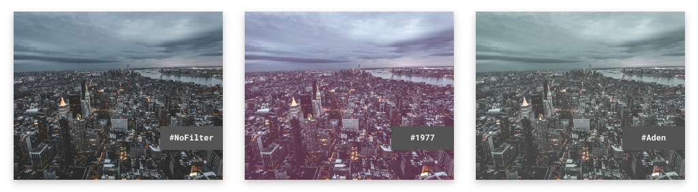
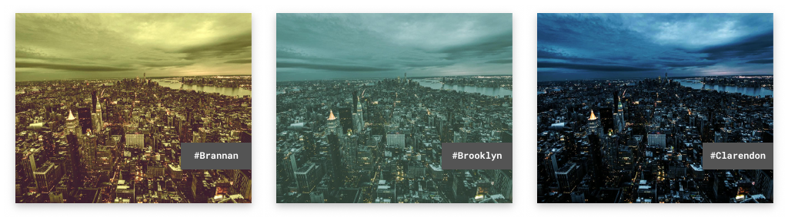
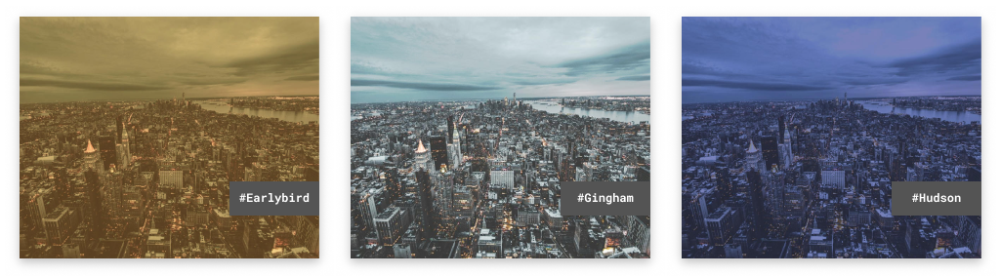
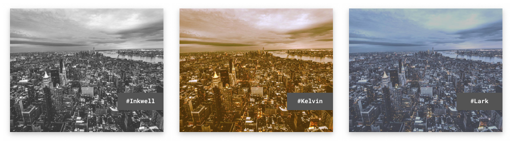
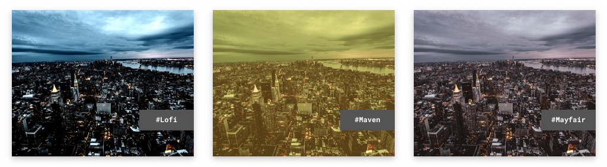
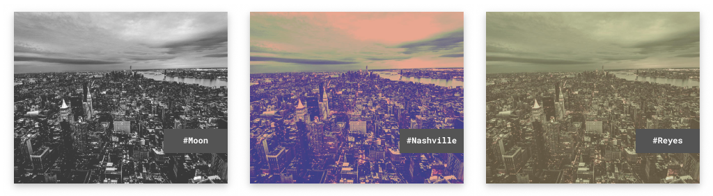
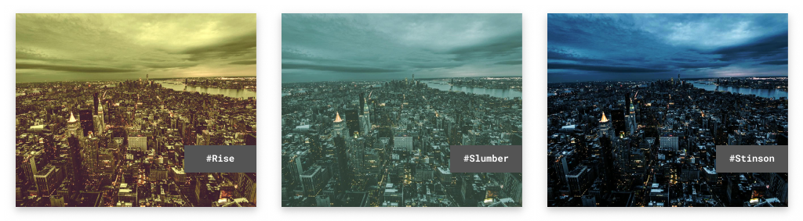
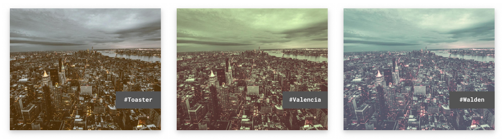

# Rustagram
[](https://travis-ci.org/ha-shine/rustagram)

Rustagram is a toy implementation of instgram-ish filters in Rust for fun and profit. 
Well no profit, but fun nonetheless.

## Usage

- ```cargo install rustagram```
- ```rustagram input.jpg 1977```

## Filters










## Credits
- [CSSgram](https://github.com/una/CSSgram) by [una](https://github.com/una) for inspiration 👩‍🎨
- [Alex Jodin](https://unsplash.com/@ajshotz) from unsplash for the photo which can be found [here](https://unsplash.com/photos/F0bx43QKhRA) 📸